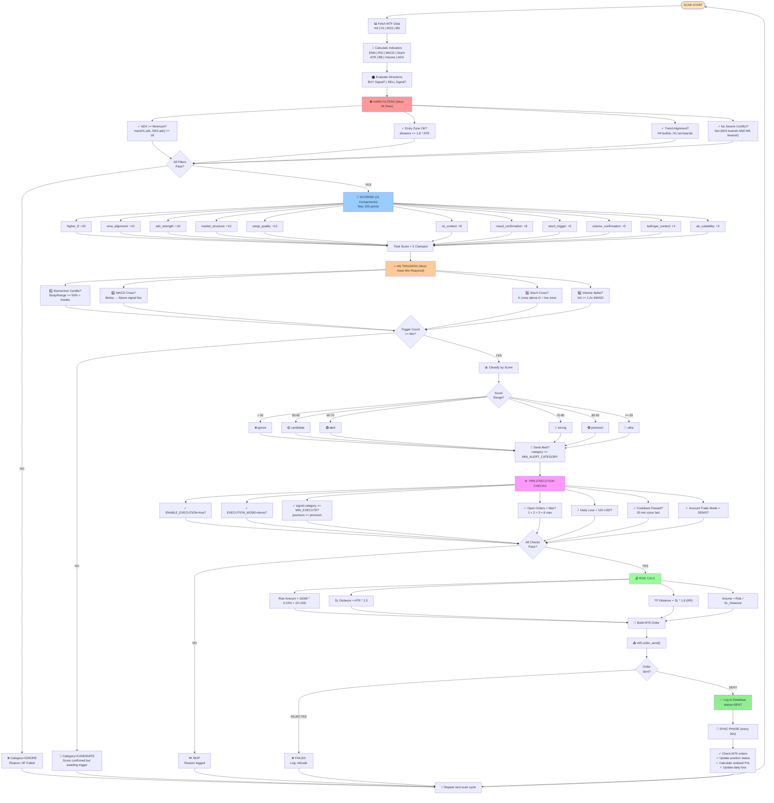

# Complete Signal Generation & Execution Flow



---

## Signal Status Examples

### ✅ Example 1: SUCCESSFUL EXECUTION
```
BTCUSD BUY
├─ Hard Filters: ✓✓✓✓ (All pass)
├─ Score: 87/100 = "premium"
├─ M5 Triggers: 4/4 (All present)
├─ Pre-Exec: ✓✓✓✓✓✓✓ (All clear)
├─ Risk: 15 USD on 1.5 ATR SL
├─ Volume: 0.1 lot
└─ Status: ✅ SENT to MT5
```

### ⚠️ Example 2: HARD FILTER REJECTION
```
ETHUSD BUY
├─ Hard Filters:
│  ├─ ADX: 12.5 < 18.0 ✗ REJECT
│  ├─ Entry Zone: OK ✓
│  ├─ Trend: OK ✓
│  └─ Conflict: OK ✓
├─ Score: Not calculated (early exit)
└─ Status: ❌ IGNORE (reason: ADX too low)
```

### ⏸️ Example 3: INSUFFICIENT M5 TRIGGERS
```
SOCUSD BUY
├─ Hard Filters: ✓✓✓✓ (All pass)
├─ Score: 72/100 = "strong"
├─ M5 Triggers: 2/4
│  ├─ Momentum: YES ✓
│  ├─ MACD: NO ✗
│  ├─ Stoch: YES ✓
│  └─ Volume: NO ✗
├─ Min Required: 2
└─ Status: 📌 CANDIDATE (score ok, awaiting trigger completion)
```

### 🚫 Example 4: MIN_EXECUTE_CATEGORY REJECTION
```
XRPUSD BUY
├─ Hard Filters: ✓✓✓✓
├─ Score: 75/100 = "strong"
├─ M5 Triggers: ✓✓✓✓
├─ Category: "strong" < "premium" (MIN_EXECUTE)
└─ Status: ⏭️ SKIPPED (reason: below_min_execute_category)
           (Alert sent if >= alert_threshold, but NOT executed)
```

### 💼 Example 5: MAX POSITIONS REACHED
```
6th Signal Arrives
├─ All checks pass ✓
├─ Current open: 6/6 (1 base + 2 premium + 3 ultra)
└─ Status: ⏭️ SKIPPED (reason: max_open_positions_reached)
           (Will retry when position closes)
```

---

## Legend

| Symbol | Meaning |
|--------|---------|
| ⛔ | Hard filter stage |
| 🎯 | Scoring stage |
| 🔥 | Trigger verification |
| ⚙️ | Pre-execution checks |
| 💰 | Risk management |
| ✅ | Success |
| ❌ | Failure/Rejected |
| ⏭️ | Skipped |
| 📌 | Waiting/Candidate |
| 🔄 | Loop/Repeat |
| 📢 | Alert notification |
| 📤 | Order submission |

---

## Key Decision Points Summary

| Gate | Input | Output | Failure Action |
|------|-------|--------|-----------------|
| Hard Filters | MTF trends, ADX, entry zone | Pass/Fail | → IGNORE |
| Scoring | 11 indicators | Score 0-100 | N/A (categorize) |
| M5 Triggers | 4 candle confirms | Count 0-4 | → CANDIDATE (if insufficient) |
| Signal Category | Score threshold | ignore/candidate/alert/.../ultra | Depends on threshold |
| Pre-Exec Checks | 7 system conditions | Pass/Fail | → SKIP |
| Risk Calc | Balance, ATR, RR | Risk amount, volume | Set defaults |
| Order Send | MT5 API | Sent/Failed | → ERROR LOG |

